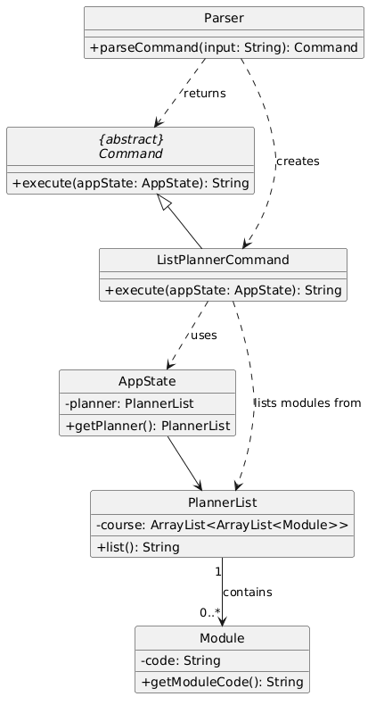

# Pathlock Developer Guide

---
## Acknowledgements

{list here sources of all reused/adapted ideas, code, documentation, and third-party libraries -- include links to the original source as well}

---
## Design

{Describe the design and implementation of the product. Use UML diagrams and short code snippets where applicable.}

### Command component
API: Command.java

{insert UML diagram here}

How the `Command` Component work:
1. When the user enters a command, the `Command` component identifies the type of command and creates the corresponding Command object.
2. This command is represented as a subclass of `Command`, such as `DoneCommand`, `RemoveCommand`, `CountCommand`, `ListCompletedCommand`, `ListIncompleteCommand`, `ListNeededCommand`, or `AddToPlannerCommand`.
3. The selected command is then executed by calling its `execute(ModuleList modules)` method. During execution, the command interacts with the ModuleList to retrieve, add, remove, or count modules. For example:
   - `DoneCommand` adds a completed module to the list and saves the updated data to storage.
   - `RemoveCommand` removes a module from the list and saves the updated data to storage.
   - `CountCommand` retrieves the total number of MCs completed.
   - `ListCompletedCommand`, `ListIncompleteCommand`, and `ListNeededCommand` retrieve different filtered views of the module list. 
4. After execution, the command returns a String result, which is then shown to the user as the system response. This is evident from the shared method signature in Command and the implementations in each subclass.

## Implementation: Russell

### Class Structure

The diagrams below show the key classes involved in `Storage` and `ProfileStorage`, and their relationships.


### Storage Implementation

#### Overview

The Storage class is responsible for persisting and retrieving a user’s completed modules from a text file.

Each user has a separate storage file stored under:
`data/users/<username>_modules.txt`
Each line represents one completed module:
`MODULE_CODE|MC`

Example:
CS2113|4
MA1521|4

### Design

The storage flow follows this pipeline:
```
Command / App → Storage.save(...) → text file → Storage.load() → List<Module> 
```
Key design decisions:

- Each user has a separate file (avoids data clashes)
- Storage centralises all file I/O logic
- Parsing is delegated to getModule() for cleaner code
- Assertions enforce valid inputs and file format

### Implementation

**initialization**
```java
public Storage(String username) {
   assert username != null && !username.trim().isEmpty() : "Username cannot be empty";
   this.filePath = "data/users/" + username.trim() + "_modules.txt";
}
```

**Loading Modules**
```java 
public List<Module> load() throws IOException
```

Steps:

1) Create file and parent directory if necessary
2) Read file line by line
3) Skip empty lines
4) Parse each line into a Module using getModule()
5) Return list of modules

***Parsing Logic***
```java
private Module getModule(String line)
```

- Splits line using "\\|"
- Validates format (exactly 2 fields)
- Parses module code and modular credits
- Creates a Module and marks it as completed

***Saving Data*** 
```java
public void save(List<Module> modules) throws IOException
```

- Overwrites file with current module list
- Writes each module as:
```java
moduleCode|mc 
```

### Sequence Diagram

Save flow


Load Flow


Why This Design?
- Separates persistence logic from business logic
- Easy to modify file format in one place
- Cleaner and more maintainable code
- Supports multiple users naturally

### ProfileStorage Implementation

The ProfileStorage class manages user profile data.

Each user profile is stored at:
`data/users/<username>_profile.txt`

Format:
`NAME|GPA`

Example:
`Russell|4.5`

### Design

Pipeline:
```
App → saveProfile() → file → loadProfile() → UserProfile
```

Key design decisions:

- Profile storage is separate from module storage
- Each user has a dedicated profile file
- getProfilePath() centralises file path logic
- Returns null if profile does not exist

### Implentation

Profile Path
```
private String getProfilePath(String username)
```
builds
```
data/users/<username>_profile.txt
```

Loading Profile

```java 
public UserProfile loadProfile(String username) throws IOException
```

Steps:

1) Validate username
2) Check if file exists
3) Return null if not found
4) Read first valid line
5) Split into name and GPA
6) Return UserProfile

Saving Profile

```java
public void saveProfile(UserProfile profile) throws IOException
```

Writes to file:
```
NAME|GPA
```

Sequence Diagram:

### Save Profile


### Load Profile


### Why This Design?
- Clear separation of concerns (modules vs profile)
- Easy to extend (e.g. add more profile fields)
- Avoids duplicated file path logic
- Simple and robust handling of missing profiles

## Implementation: Shi Yong

### Class Structure

The diagram below shows the key classes involved in the `done` and `remove` commands and their relationship.


### `done` Command Implementation

#### Overview

The `done` command marks a module as completed and records it towards the user's graduation progress.

- **Internal module** (e.g `done CS2113`): the MC value is lookup automatically from the moduel database.
- **External module** (e.g `done GEC1001`): the user must supply the MC count explicitly via `/mc`.

#### Design

The command follows the standard execution pipeline:

```
PathLock (Main) → Parser → DoneCommand → ModuleValidator → ModuleList → Storage
```

Key design decisions:
- **`ModuleValidator`** centralises all input validation (module code format, MC value, MC mismatch), keeping `DoneCommand` focused solely on orchestration.
- **`DoneCommand`** delegates to two private helpers — `handleInternalModule()` and `handleExternalModule()` — to cleanly separate the two execution paths.

#### Implementation

**Parsing**

`parseDone()` checks for the `/mc` flag by splitting on `"/mc"`. If found, the module code and MC integer are extracted separately. If not found, `mc` is passed as `null`. This means `DoneCommand` receives a fully-parsed command object and never needs to interpret raw strings itself.

```java
if (remaining.contains("/mc")) {
    String[] parts = remaining.split("/mc", 2);
    moduleCode = parts[0].trim();
    mc = Integer.parseInt(parts[1].trim());
} else {
    moduleCode = remaining;
}
```

**Execution**

1. `ModuleValidator.validateModuleCode()` rejects codes that do not match the NUS format (2–3 letters + 4 digits + optional letter).
2. `isRecognisedModule()` determines whether to take the internal or external path.
3. Both paths call `Storage.save(modules.getCompletedModules())` as the final step to persist the change.

#### Sequence Diagram

The diagram below shows the internal module path (`done CS2113`):


The diagram below shows the external module path (`done GEC1001 /mc 4`):


#### Why This Design?

The split into `handleInternalModule()` and `handleExternalModule()` avoids a deeply nested `if/else` block inside `execute()`. Each helper has a clear, single responsibility — easy to read, test, and extend independently.

Delegating validation to `ModuleValidator` means that if the NUS module code format ever changes, only one class needs updating.

---
### `remove` Command Implementation

#### Overview

The `remove` command undoes a previously recorded completion. For example, `remove CS2113` resets `CS2113` back to incomplete and removes it from the saved progress. It supports both internal and external modules.

#### Design

```
PathLock (Main) → Parser → RemoveCommand → ModuleList → Storage
```

`RemoveCommand` is deliberately thin. It calls `modules.removeModule()`, always saves, and returns a result string. No validation class is needed because `Parser` already ensures the module code is non-empty.

`removeModule()` does **not** delete any `Module` object. For internal modules, it calls `module.markIncompleted()` — reverting status to `INCOMPLETE`. This preserves the integrity of the `allModules` map, which is used by all other commands.

#### Sequence Diagram
The diagram below shows remove module path (`remove CS2113`):


#### Why This Design?

Using `markIncompleted()` rather than deleting the `Module` object keeps the `allModules` map intact. This map is the shared database for `isRecognisedModule()`, `getMcForModule()`, and `listNeededModules()` — all of which depend on all modules being present regardless of completion status.

---
### Duplicate Module Check Implementation

#### Overview

The duplicate module check prevents a user from recording the same module as completed more than once. It is enforced inside `ModuleList` for both internal and external modules, and surfaces to the user as:
`"Module <code> has already been completed"`.

#### Sequence Diagram
The diagram below shows duplicate module check path:


---
## Implementation: Brian

### Class Structure

The diagram below shows the key classes involved in the `list` commands and the `help` command, and their relationships.


### `list` Commands Implementation

#### Overview

The three list commands provide different filtered views of the module list:

- `list completed` — shows all modules the user has marked as done.
- `list incomplete` — shows all required CEG modules not yet completed, including OR-group modules (e.g. `CS2103 OR CS2113`).
- `list needed` — shows every required module for graduation.

All three commands are **read-only** — they do not modify any data or write to storage.

#### Design

All three commands follow the same execution pipeline:

```
PathLock (Main) → Parser → ListCommand → AppState → ModuleList → returns String
```

Key design decisions:
- All three commands are **thin wrappers** — each one extracts `ModuleList` from `AppState` and delegates to a single method on `ModuleList`. The formatting and filtering logic lives entirely in `ModuleList`, keeping the command classes focused solely on retrieval.
- Using **three separate command classes** (rather than a single `ListCommand` with a flag) keeps each class independently testable and avoids branching logic inside `execute()`.
- `listIncompleteModules()` and `listNeededModules()` handle **OR groups** by tracking which `orGroup` labels have already been listed, preventing duplicates when multiple modules share the same OR group.

#### Implementation

**Parsing**

`Parser.parseCommand()` performs exact string matching for the three list commands:

```java
if (input.equals("list completed")) {
    return new ListCompletedCommand();
}
if (input.equals("list incomplete")) {
    return new ListIncompleteCommand();
}
if (input.equals("list needed")) {
    return new ListNeededCommand();
}
```

**Execution**

Each command's `execute()` follows the same pattern:

```java
@Override
public String execute(AppState appState) {
    ModuleList modules = appState.getModule();
    assert modules != null : "ModuleList should not be null";
    String result = modules.listCompletedModules(); // or listIncompleteModules() / listNeededModules()
    return result;
}
```
Inside `ModuleList`:

- `listCompletedModules()` iterates over both `allModules` and `externalModules`, collecting entries where `module.isCompleted()` is true, then formats them as a numbered list.
- `listIncompleteModules()` iterates over `allModules`, skipping OR groups already listed and modules already completed. It uses `isOrGroupFulfilled()` to check if any member of an OR group has been completed before listing the group.
- `listNeededModules()` iterates over `allModules` and lists every module or OR group without filtering by completion status.

#### Sequence Diagram

The diagrams below shows the execution path for `list completed`, `list incomplete` and `list needed`.


#### Why This Design?

Delegating all formatting logic to `ModuleList` means the three command classes stay extremely lightweight and identical in structure. If the output format ever needs to change (e.g. adding MC counts next to each module), only `ModuleList` needs updating — not three separate command classes.

---
### `help` Command Implementation

#### Overview

The `help` command gives users two views:
- `help` (no argument) — prints a grouped overview of all available commands.
- `help <command>` (with argument) — prints a detailed breakdown of a specific command, including its purpose, usage format, and example output.

#### Design

```
PathLock (Main) → Parser → HelpCommand → returns String
```

`HelpCommand` does not interact with `AppState` or `ModuleList` for its core logic. All help content is inside `HelpCommand` itself via `buildHelpMap()`. 

Key design decisions:
- **`buildHelpMap()`** stores all detailed help strings in a `LinkedHashMap<String, String>`, keyed by normalised topic name. This separates content from lookup logic, making it easy to add new commands to the help system without changing control flow.
- **`normaliseTopic()`** handles variations in how users might type command names (e.g. extra spaces, mixed case), mapping them to a canonical key before querying the map.

#### Implementation

**Parsing**

```java
if (input.equals("help")) {
    return new HelpCommand(); // no argument constructor, topic = null
}
if (input.startsWith("help ")) {
    String topic = input.substring(5).trim();
    return new HelpCommand(topic); // topic argument constructor
}
```

**Execution**

```java
@Override
public String execute(AppState appState) {
    if (topic == null || topic.isEmpty()) {
        return showGeneralHelp();
    }
    return showDetailedHelp(topic);
}
```

`showGeneralHelp()` builds and returns a fixed formatted string grouping all commands by category (List Commands, Module Management, Module Planner, PathLock System).

`showDetailedHelp()` calls `normaliseTopic()` on the input, then looks up the result in `buildHelpMap()`. If no match is found, it returns a fallback message directing the user to `help`.

```java
private String showDetailedHelp(String inputTopic) {
    Map<String, String> helpMap = buildHelpMap();
    String normalisedTopic = normaliseTopic(inputTopic);
    if (helpMap.containsKey(normalisedTopic)) {
        return helpMap.get(normalisedTopic);
    }
    return dash + "\nNo detailed help found for \"" + inputTopic + "\".\n"
            + "Type 'help' to see all available commands.\n" + dash;
}
```

#### Sequence Diagram

The diagram below shows the execution path for `help`:


The diagram below shows the execution path for `help done`:


#### Why This Design?

Storing all help content in `buildHelpMap()` as a `LinkedHashMap` means that adding a new command to the help system requires only one change, a new entry in the map, without touching control flow or the general help string separately.

`normaliseTopic()` acting as a pre-processing step keeps `showDetailedHelp()` clean. If future commands have aliases or shorthand (e.g. `lc` for `list completed`), `normaliseTopic()` is the only place that needs updating.

---
## Implementation: Ryan

### Class Structure

The diagram below shows the key classes involved in the `prereq`, `postreq`, and `count` commands and their relationships.


### `prereq` Command Implementation

#### Overview

The `prereq` command displays the prerequisites needed before taking a specified module. For example, `prereq CS2113` shows that CS2040C must be completed before taking CS2113.

#### Design

The command follows the standard execution pipeline:

```
PathLock (Main) → Parser → PrereqCommand → AppState → ModuleList → Module
```

Key design decisions:
- **`PrereqCommand`** delegates all prerequisite lookup logic to `ModuleList.getPrerequisites()`, keeping the command focused solely on orchestration.
- The module code is normalised to uppercase in the constructor, ensuring case-insensitive matching throughout.

#### Implementation

**Parsing**

`Parser.parseCommand()` checks for the `prereq ` prefix. If the input is bare `prereq` with no module code, a `MissingCommandException` is thrown. Otherwise, the module code is extracted and passed to the `PrereqCommand` constructor.

```java
String prereqPrefix = "prereq ";
if (input.equals("prereq")) {
    throw new MissingCommandException("Please input module code after 'prereq '");
}
if (input.startsWith(prereqPrefix)) {
    String moduleCode = input.substring(prereqPrefix.length()).trim();
    if (moduleCode.isEmpty()) {
        throw new MissingCommandException("Please input module code after 'prereq '");
    }
    return new PrereqCommand(moduleCode);
}
```

**Execution**

1. `PrereqCommand.execute()` retrieves `ModuleList` from `AppState`.
2. `ModuleList.getPrerequisites()` looks up the module in `allModules` and calls `Module.getPrerequisites()` to get the prerequisite list.
3. If the module is not recognised, a message is returned. If recognised but has no prerequisites, a different message is returned.

#### Sequence Diagram

The diagram below shows the execution path for `prereq CS2113`:


#### Why This Design?

`PrereqCommand` is deliberately thin — it retrieves `ModuleList` from `AppState` and delegates entirely to `getPrerequisites()`. This keeps prerequisite lookup logic in one place (`ModuleList`), making it easy to test and modify without touching the command class.

---
### `postreq` Command Implementation

#### Overview

The `postreq` command displays the modules unlocked by completing a specified module. For example, `postreq CS1010` shows all modules that list CS1010 as a prerequisite.

#### Design

```
PathLock (Main) → Parser → PostreqCommand → AppState → ModuleList
```

Key design decisions:
- **`PostreqCommand`** follows the same pattern as `PrereqCommand` for consistency.
- `ModuleList.getModulesUnlockedBy()` iterates through all modules and checks if the given module code appears in each module's prerequisite list. This is a reverse lookup compared to `getPrerequisites()`.

#### Implementation

**Parsing**

Identical pattern to `prereq` — checks for the `postreq ` prefix and throws `MissingCommandException` if no module code is provided.

**Execution**

1. `PostreqCommand.execute()` retrieves `ModuleList` from `AppState`.
2. `ModuleList.getModulesUnlockedBy()` iterates through every module in `allModules`, checking if the target module code appears in each module's prerequisite list.
3. Matching modules are collected and returned as a formatted string.

#### Sequence Diagram

The diagram below shows the execution path for `postreq CS1010`:


#### Why This Design?

The split into separate `PrereqCommand` and `PostreqCommand` classes (rather than a single command with a flag) follows the Single Responsibility Principle. Each command has one clear purpose and can be tested independently. The reverse lookup in `getModulesUnlockedBy()` avoids the need for a separate "post-requisite" data structure — it reuses the existing prerequisite data by searching in the opposite direction.

---
### `count` Command Implementation

#### Overview

The `count` command displays the user's MC progress towards the 160 MCs required for CEG graduation. It shows completed MCs, remaining MCs, and percentage progress.

#### Design

```
PathLock (Main) → Parser → CountCommand → AppState → ModuleList
```

`CountCommand` is the simplest of the three commands — it has no fields (unlike `PrereqCommand` and `PostreqCommand` which store a module code). It retrieves `ModuleList` from `AppState` and delegates entirely to `ModuleList.countMcs()`.

#### Implementation

**Parsing**

```java
if (input.equals("count")) {
    return new CountCommand();
}
```

**Execution**

`CountCommand.execute()` retrieves `ModuleList` from `AppState` and calls `countMcs()`, which iterates over all completed modules (both internal and external), sums their MC values, and returns a formatted progress string.

#### Sequence Diagram

The diagram below shows the execution path for `count`:


#### Why This Design?

`CountCommand` has no fields and no branching — it is a single delegation to `ModuleList.countMcs()`. This keeps the command class minimal and puts all MC calculation logic in `ModuleList`, consistent with how `PrereqCommand` and `PostreqCommand` delegate to `ModuleList` for their respective lookups.

---
## Implementation: Kailer<br>Planner Feature Classes
### Class Structure

The diagrams below show the key classes involved in the planner feature and their relationships

`planner list`<br>


`planner add`<br>


`planner remove`<br>


`planner edit`<br>


### `planner list` Command Implementation
#### Overview
The `planner list` command displays all the mods the user has added into the planner in order of semesters.

### Design

The command follows the standard execution pipeline:
```
PathLock (Main) → Parser → ListPlannerCommand → AppState → PlannerList
```

It then loops through the 2D array `course` stored in PlannerList and prints the moduleCode out.A

#### Implementation

**Parsing**

`Parser.parseCommand()` checks for the `planner` then `list`

**Execution**

1. `ListPlannerCommand.execute()` retrieves `PlannerList` from `AppState`.
2. Returns `PlannerList.list()`
3. `PlannerList.list()`
4. The planner stores its modules in `course`, an `ArrayList` of size 8, where each index corresponds to a semester.
5. The method creates a `StringBuilder` named `output` to build the final string efficiently.
6. It iterates through `course` sequentially from index `0` to `7`, ensuring that semesters are listed in order.
7. For each semester, the method first appends a semester header in the format `Semester: X`, where `X` ranges from `1` to `8`.
8. It then retrieves the `ArrayList<Module>` corresponding to that semester.
9. The method iterates through all `Module` objects stored in that semester and appends each module’s code on its own line.
10. After all 8 semesters have been processed, the method returns the constructed string.
11. Even if a semester does not contain any modules, its header is still displayed. This ensures that the planner structure remains explicit and consistently formatted for the user.

### `planner add` Command Implementation

#### Overview

The `planner add` command allows the User to add modules to the planner which can then be show with `planner list`

#### Design
```
PathLock (Main) → Parser → AddToPlannerCommand → AppState → PlannerList
```

Key design decisions:
- PlannerList is a separate list from ModuleList as whether a mod is plan or unplanned is independent on whether the User has completed the mod or not
- PlannerList uses a 2D arrayList to allow for easy insertion and removal of mods across all 8 semesters

#### Implementation

**Parsing**
`Parser.parseCommand()` checks for the `planner` then `add`. If subsequent input is bare a `MissingCommandException` is thrown. Otherwise, the module code and semester is extracted and passed to the `AddToPlannerCommand` constructor.

**Execution**
1. `AddToPlannerCommand.execute()` retrieves `ModuleList` and `PlannerList` from `Appstate`
2. `moduleList.getModule(moduleCode)` retrieves Module based of `moduleCode`
3. If module null, means moduleCode does not exist, `IllegalArgumentException` is thrown
4. It sets `Module` semester attribute, if semester is of incorrect format `IllegalArgumentException` is thrown
5. Executes `PlannerList.addModule(module)`
6. It extracts semester, and inserts it into the respective array index of course

### `planner remove` Command Implementation
#### Overview
The `planner remove` command allows the User to remove the modules that are in the planner should they not want it

#### Design
```
PathLock (Main) → Parser → RemoveFromPlannerCommand → AppState → PlannerList
```

Key design decisions:
- `planner remove` does not care if moduleCode exists or not as for it to be added to planner it should exist based on `planner add` implementation

#### Implementation

**Parsing**
`Parser.parseCommand()` checks for the `planner` then `remove`. If subsequent input is bare a `MissingCommandException` is thrown. Otherwise, the module code is extracted and passed to the `RemoveFromPlannerCommand` constructor.

**Execution**
1. `RemoveFromPlanner.execute()` retrieves `PlannerList` from `AppState`
2. Sweeps through every `Module` in `course` and retrieves their `ModuleCode`
3. If it matches, `Module` is removed
4. If no matches found, `NoSuchElementException` is thrown

### `planner edit` Command Implementation
#### Overview
The `planner edit` command allows the User to make changes to what semester they plan to take a module.

#### Design
```
PathLock (Main) → Parser → EditPlannerCommand → AppState → PlannerList
```
Key design decisions:
- `planner edit` removes the current module, changes the `semester` attribute then reinserts it
- This is done to help update the position of the module with respect to the course arrayList

#### Implementation
**Parsing**
`Parser.parseCommand()` checks for the `planner` then `edit`. If subsequent input is bare a `MissingCommandException` is thrown. Otherwise, the module code and semester is extracted and passed to the `EditPlannerCommand` constructor.

**Execution**
1. `EditPlannerCommand.execute()` retrieves `ModuleList` and `PlannerList` from `AppState`
2. `moduleList.getModule(moduleCode)` retrieves Module based of `moduleCode`
3. If module null, means moduleCode does not exist, `IllegalArgumentException` is thrown
4. Sets module's `semester` to inputted semester, if semester is in wrong format `IllegalArgumentException` is thrown 
5. Executes `PlannerList.removeModule(moduleCode)` (see `planner remove` for execution)
6. Executes `PlannerList.addModule(module)` (see `planner add` for execution)

---
## Product scope
### Target user profile
- Y1-Y4 Computer Engineering Undergraduate Students (JC path)
- did not follow the recommended TimeTable
- has a need to manage complex multi-year university pathways
- can type fast
- is reasonably comfortable using CLI apps


### Value proposition

PathLock provides a lightweight, offline CLI tool for CEG students to organise complex multi-year university pathways,
tracking completed modules, monitoring MC progress, and managing graduation requirements without needing a
database or internet connection.

---
## User Stories

|Version| As a ... | I want to ...                                           | So that I can ...                                           |
|--------|----------|---------------------------------------------------------|-------------------------------------------------------------|
|v1.0|New User| see usage instructions                                  | refer to them when I forget how to use the application      |
|v1.0|User| see my output                                           | know what I entered                                         |
|v2.0|User| have a planner mode                                     | plan which mods I want to take when                         |
|v2.0|User| add mods to the planner                                 | -                                                           |
|v2.0|User| be able to edit the mods I have indicated in my planenr | correct any mistakes I made                                 |
|v2.0|User| have a visual indication of my planner                  | so that I can see my whole planned timetable over my course |

---
## Non-Functional Requirements

1. Should work on any mainstream OS (Windows, macOS, Linux) with Java 17 or above installed.
2. All data is stored locally and the application should work fully without internet connectivity.
3. The saved plan file should remain human-readable and editable with a standard text editor.

---
## Glossary

* *glossary item* - Definition
---

## Instructions for manual testing

{Give instructions on how to do a manual product testing e.g., how to load sample data to be used for testing}
